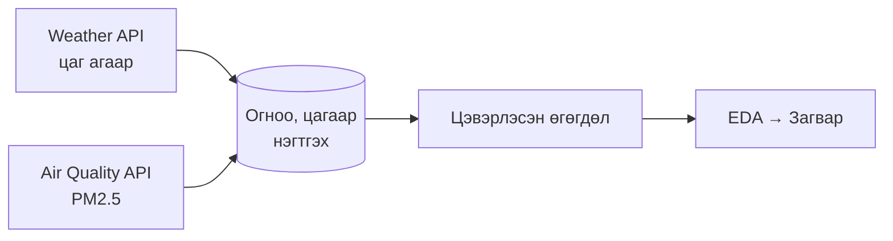

```qmd
---
title: "Улаанбаатар хотын PM2.5 агаарын бохирдлын таамаглал"
subtitle: "Цаг агаарын өгөгдлөөр PM2.5-ийг таамаглах машин сургалтын загвар"
author: "Д. Аахангай · Б. Өсөхбаяр · А. Баясгалан"
date: 2026
format:
  revealjs:
    theme: default
    transition: slide
    slide-number: true
    footer: "PM2.5 таамаглал · Магадлал Статистикийн Төсөл · 2026"
    logo: false
    toc: false
    chalkboard: false
    highlight-style: github
execute:
  eval: false
---

## Судалгааны зорилго {.center}

**Яагаад PM2.5-ийг цаг агаарын өгөгдлөөр таамаглах ёстой вэ?**

::: {.r-fit-text}
PM2.5 нь 2.5 микрометрээс бага диаметртэй тоосонцор бөгөөд хүний эрүүл мэндэд хамгийн их сөрөг нөлөөтэй бохирдуулагч юм.
:::

**Улаанбаатар ба өвлийн бохирдол**  
Түлш түлдэг үед гэр хорооллын зуух, агаарын урвуу давхарга (температурын инверси) PM2.5-ийг ихсэхэд нөлөөлдөг.

**Судалгааны асуулт**  
> *"Цаг агаарын өгөгдлөөр PM2.5-ийг таамаглаж болох уу?"*

**Хүлээгдэж буй үр өгөөж**  
Эрүүл мэндийн анхааруулга · Богино хугацааны таамаглал · Бодлого боловсруулагчдад нотолгоо

---

## Өгөгдлийн эх сурвалж {.center}

**Open‑Meteo нээлттэй API · 2019–2024 · цагийн нарийвчлал**

| Weather API                                | Air Quality API          |
|--------------------------------------------|--------------------------|
| • температур (°C)                          | • PM2.5 агууламж (µg/m³) |
| • салхины хурд (km/h)                      | → **Зорилтот хувьсагч**  |
| • харьцангуй чийгшил (%)                   |                          |
| • гадаргын даралт (hPa)                    |                          |
| • хур тунадас (mm)                         |                          |

**Байршил:** Улаанбаатар · 47.92°N, 106.91°E  
**Хугацаа:** 2019.01.01 – 2024.12.31  
**Нарийвчлал:** Цагийн өгөгдөл

---

## Өгөгдөл нэгтгэх урсгал {.center}



Цаг бүрийн цаг агаарын үзүүлэлт PM2.5-ийн утгатай нэг мөрөнд нэгтгэгдэнэ.

---

## Өгөгдлийн цэвэрлэгээ {.center}

| Үзүүлэлт               | Утга     |
|------------------------|----------|
| Анхны өгөгдөл          | 43,824   |
| Цэвэрлэсний дараа      | 31,056   |
| Устгасан               | 12,768 (29.1%) |
| Сургалт / Шалгалт      | 24,844 / 6,212 |

**Цэвэрлэгээний алхмууд:**
- NaN утгатай мөрүүдийг устгасан
- Давхардсан огноо, цагийн утгуудыг устгасан
- PM2.5 < 0 боломжгүй утгуудыг устгасан
- Сургалт/шалгалт = 80/20 хуваалт

---

## Ашигласан оролтын шинжүүд {.center}

| Шинж                  | Тайлбар                              |
|-----------------------|--------------------------------------|
| `temperature_2m`      | Температур (°C)                      |
| `relative_humidity_2m`| Харьцангуй чийгшил (%)               |
| `wind_speed_10m`      | Салхины хурд (km/h)                  |
| `precipitation`       | Хур тунадас (mm)                     |
| `surface_pressure`    | Гадаргын даралт (hPa)                |
| `month`               | Сар (1–12)                           |
| `hour`                | Цаг (0–23)                           |
| `heating_season`      | Халаалтын улирал (10-4-р сар = 1)   |
| `temp_x_wind`         | Температур × Салхи (харилцан үйлчлэл) |

---

## EDA · Корреляцийн шинжилгээ {.center}

| Хувьсагч               | Корреляц |
|------------------------|----------|
| `temperature_2m`       | **-0.64**|
| `wind_speed_10m`       | **-0.47**|
| `temp_x_wind`          | -0.38    |
| `heating_season`       | 0.55     |
| `surface_pressure`     | 0.12     |
| `relative_humidity_2m` | 0.08     |

**Гол дүгнэлт:**  
Температур буурах, түлш түлдэг үе эхлэх, салхи багасах үед PM2.5 өсөх хандлагатай.

---

## Ашигласан загваруудын тойм {.center}

| Загвар            | Онцлог                                                                 |
|-------------------|------------------------------------------------------------------------|
| **Linear Regression** | Шугаман хамаарал, OLS арга, тайлбарлахад хялбар                       |
| **Bayesian Ridge**    | Regularization + 95% итгэлцлийн интервал, Gaussian prior               |
| **Decision Tree**     | Шугаман бус хамаарал, feature importance, модны бүтэц                  |

---

## Linear Regression {.center}

ŷ = β₀ + β₁x₁ + β₂x₂ + … + βₙxₙ

- **StandardScaler** хэрэглэж µ = 0, σ = 1 болгосон  
- β коэффициент бүр оролтын шинжийн нөлөөг хэмждэг  
- Хэрэгжүүлэхэд хялбар, тайлбарлахад тохиромжтой  
- Сул тал: өндөр PM2.5 утгуудыг дутуу таамагладаг  

**R² = 0.517**

---

## Bayesian Ridge Regression {.center}

P(β \| X, y) ∝ P(y \| X, β) · P(β)

- Bayesian regularization → хэт тохирлоос сэргийлнэ  
- 95% итгэлцлийн интервал (CI) тооцоолох боломжтой  
- `max_iter = 500`  
- Linear Regression-тэй маш төстэй гүйцэтгэл  

**R² = 0.517**

---

## Decision Tree Regressor {.center}

MSE = (1/n) · Σ(yᵢ − ȳ)²

- Шугаман бус хамаарлыг автоматаар олж барина  
- `max_depth = 6`, `min_samples_leaf = 50`  
- `feature_importances_` → оролтын шинжүүдийн чухлыг хэмждэг  
- PM2.5-ийн 0-ээс бага утга таамаглахгүй  

**R² = 0.535** (ШИЛДЭГ)

---

## Загвар сургах ба үнэлэх алхам {.center}

1. **Сургалт/шалгалт хуваалт** → 80 / 20  
2. **Загвар сургах** → LR, BR, DT  
3. **Таамаглал** → y_pred  
4. **Үнэлгээ** → MAE, RMSE, R²

Бүх загварыг ижил сургалт/шалгалт хуваалт дээр сургаж, ижил үнэлгээний үзүүлэлтүүдээр харьцуулав.

---

## Загваруудын гүйцэтгэл {.center}

| Загвар            | MAE (µg/m³) | RMSE (µg/m³) | R²    |
|-------------------|-------------|--------------|-------|
| Linear Regression | ~7.xx       | ~10.xx       | 0.517 |
| Bayesian Ridge    | ~7.xx       | ~10.xx       | 0.517 |
| Decision Tree     | Хамгийн бага| Хамгийн бага | **0.535** |

Decision Tree бүх үнэлгээний үзүүлэлтээр хамгийн сайн үр дүн үзүүлсэн — шугаман бус хамаарлыг илрүүлж байна.

---

## Таамагласан ба бодит утга — Linear Regression {.center}

**R² = 0.517**

- Бага PM2.5-ийг боломжийн таамагласан  
- Өндөр утгуудыг (60+ µg/m³) дутуу таамагласан  
- Зарим тохиолдолд PM2.5-ийн 0-ээс бага утга таамагласан  

---

## Таамагласан ба бодит утга — Bayesian Ridge {.center}

**R² = 0.517**

- LR-тэй маш төстэй тархалт  
- Regularization нэмэлт давуу тал өгөөгүй  
- Давуу тал: 95% итгэлцлийн интервал тооцоолдог (дараагийн слайд)

---

## Таамагласан ба бодит утга — Decision Tree {.center}

**R² = 0.535**

- Шугаман бус хамаарлыг илүү сайн барьсан  
- Хэвтээ зурвас — төгсгөлийн зангилаа бүрт тогтмол утга  
- PM2.5-ийн 0-ээс бага утга таамаглахгүй  

---

## R² харьцуулалт {.center}

| Загвар            | R²    |
|-------------------|-------|
| Linear Regression | 0.517 |
| Bayesian Ridge    | 0.517 |
| Decision Tree     | **0.535** |

**Дүгнэлт:** Decision Tree PM2.5-ийн өөрчлөлтийн **53.5%-ийг** цаг агаарын өгөгдлөөр тайлбарласан.

---

## Шинжийн чухал зэрэглэл (Decision Tree) {.center}

| Шинж                    | Чухал зэрэг |
|-------------------------|-------------|
| `temperature_2m`        | **53.4%**   |
| `wind_speed_10m`        | **18.9%**   |
| `temp_x_wind`           | **11.2%**   |
| `surface_pressure`      | 6.5%        |
| `hour`                  | 4.3%        |
| `month`                 | 2.8%        |
| `relative_humidity_2m`  | 1.7%        |
| `precipitation`         | 0.8%        |
| `heating_season`        | 0.4%        |

**Температур хамгийн чухал хүчин зүйл болсон.**

---

## Bayesian Ridge — 95% итгэлцлийн интервал {.center}

- 95% итгэлцлийн интервал ихэнх утгыг хамарсан  
- Хэт өндөр PM2.5 үед зарим утга интервалаас гарсан  
- Бодлого боловсруулагчдад тодорхойгүй байдлыг үнэлэх боломж  
- Цэгэн таамаглалд итгэлцлийн интервал нэмэлт мэдээлэл өгдөг  

---

## Загварын хязгаарлалт {.center}

- **Зөвхөн цаг агаарын өгөгдөл** — бусад хүчин зүйлс (замын хөдөлгөөн, ялгаруулалт, дүүргийн түвшний өгөгдөл) ороогүй  
- **Нэг координат дээр суурилсан** — Улаанбаатар хотыг төлөөлөх координат (47.92°N, 106.91°E)  
- **Урт хугацааны шууд таамаглал биш** — цаг агаарын урьдчилсан мэдээ ашиглавал 24–72 цагийн PM2.5 таамаглал хийх боломжтой  

---

## Дүгнэлт {.center}

- **Decision Tree хамгийн сайн загвар:** R² = 0.535  
- **Температур хамгийн чухал хүчин зүйл:** 53.4%  
- **Салхины хурд хоёр дахь чухал хүчин зүйл:** 18.9%  
- Цаг агаарын өгөгдлөөр PM2.5-ийг дунд түвшний нарийвчлалтай таамаглаж чадсан  
- Нэмэлт өгөгдөл (замын хөдөлгөөн, ялгаруулалт) оруулбал загвар сайжрах боломжтой  

> Энэ судалгаа нь цаг агаарын урьдчилсан мэдээг ашиглан агаарын чанарын богино хугацааны анхааруулга хийх боломжтойг харуулж байна.

---

## Багийн оролцоо {.center}

| Гишүүн           | Гүйцэтгэсэн ажил                         |
|------------------|------------------------------------------|
| **Д. Аахангай**  | Тайлан болон танилцуулга бэлтгэх         |
| **Б. Өсөхбаяр**  | Өгөгдөл бэлтгэх, ерөнхий загвар          |
| **А. Баясгалан** | Python дээр загвар сургах                |

---

## Баярлалаа {.center}

**Асуулт байна уу?**

Д. Аахангай · Б. Өсөхбаяр · А. Баясгалан  
*Магадлал Статистикийн Төсөл · 2026*
```
